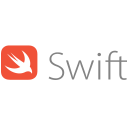

## Hello there! I'm Mohamed  
I'm a software engineer who is passionate about making an impact through crafting software-based solutions to real-world problems. My area of expertise mostly lies in backend engineering, but I am proficient enough on the frontend to build performant and visually appealing full-stack applications. I'm a strong believer that there is beauty in simplicity, and that clean, well-structured code is the key to achieving that. Currently, I'm learning as much as I can about open source to be able to make an impact on a larger scale through my work.

## My Toolkit 

  
  
  
  
  
  
  
  
  
  
  
  
  
  
  

## Get in touch!  
If you'd like to say hi and connect, feel free to reach out to me via the socials on my profile!
