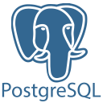

## Hello there! I'm Mohamed  
I'm a software engineer who is passionate about making an impact through crafting software-based solutions to real-world problems. My area of expertise mostly lies in backend engineering, but I am proficient enough on the frontend to build performant and visually appealing full-stack applications. I'm a strong believer that there is beauty in simplicity, and that clean, well-structured code is the key to achieving that. Currently, in addition to undertaking an internship as a backend software engineer at [PanData Tech](https://pandata.qa/), I'm learning as much as I can about open source to be able to make an impact on a larger scale through my work.

## My Toolkit 
### Professionally
As a backend software engineering intern at [PanData Tech](https://pandata.qa/), I am currently working with the following technologies:  

  
  
  
  
  
  

### Other
Outside of work, I like to spend my time crafting software using the following technologies:  

  
  
  
  
  
  
  
  
  
  
  
  

## Get in touch!  
If you're looking for a reliable and hardworking fresh graduate *(as of May 2024!)* with an undying drive to learn, or just want to say hi and connect, feel free to reach out to me via the socials on my profile!